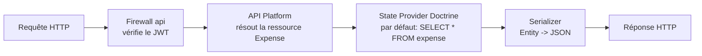
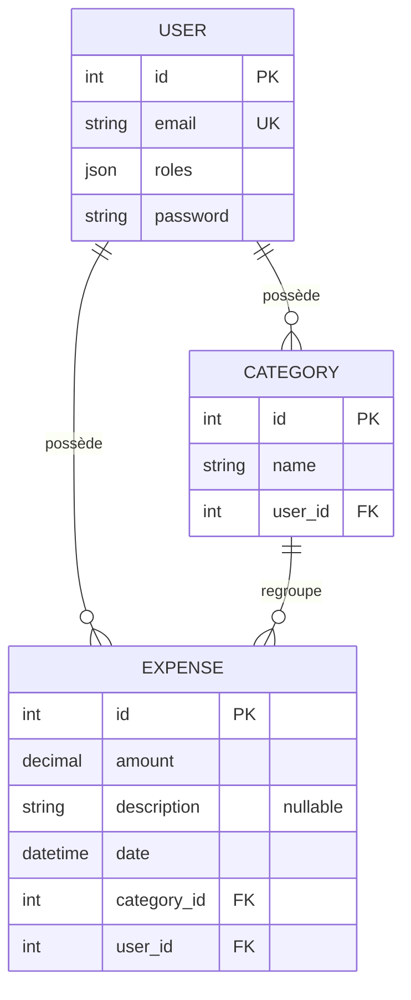
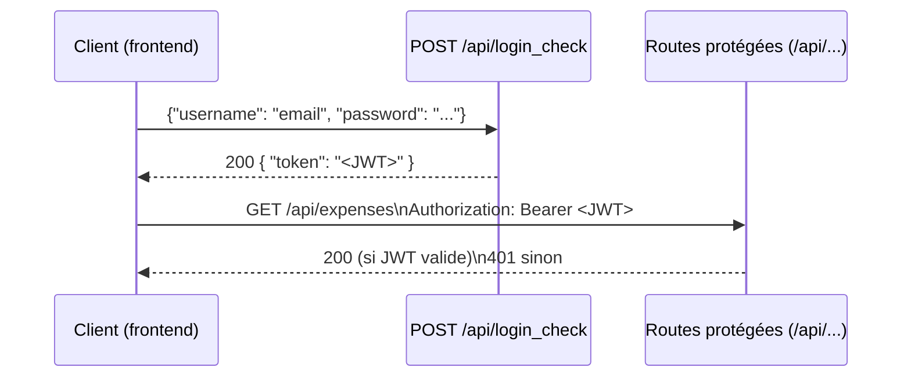

# Documentation — Backend (Expense Tracker)

> Généré à partir de l'état du dépôt `stanley-minh/Expense-Tracker` au 08/09/2026 (branche par défaut). À tenir à jour au fil des évolutions — un doc obsolète est pire qu'une absence de doc.

## 1. Vue d'ensemble

Le dossier `backend/` contient l'API REST de l'application de suivi de dépenses. C'est une API **Symfony 8.1** exposée automatiquement via **API Platform 4.3** : on ne code quasiment aucune route à la main, API Platform génère le CRUD REST directement à partir des entités Doctrine annotées `#[ApiResource]`.

**Stack effective** (d'après `composer.json`) :

| Composant | Rôle |
|---|---|
| PHP `>=8.4` | Le `composer.json` demande 8.4+, le README du repo indique 8.5 — vérifie la version réellement installée avec `php -v` |
| Symfony `8.1.*` | Framework HTTP, DI, routing, sécurité |
| API Platform `^4.3` (`doctrine-orm` + `symfony`) | Génération de l'API REST à partir des entités |
| Doctrine ORM `^3.6` + Migrations `^4.0` | Persistance et évolution du schéma |
| LexikJWTAuthenticationBundle `^3.2` | Authentification par JWT |
| NelmioCorsBundle `^2.6` | Autoriser le frontend (autre origine) à appeler l'API |
| PHPUnit `^13.3` (+ `api-platform/symfony` `ApiTestCase`) | Tests fonctionnels |

## 2. Architecture : comment API Platform génère l'API

C'est le point le plus important à comprendre pour naviguer dans ce dossier, parce qu'il explique pourquoi `src/Controller/` et `src/ApiResource/` sont vides.

- **Pas de contrôleurs écrits à la main.** Chaque entité de `src/Entity/` porte l'attribut `#[ApiResource]`. API Platform lit cet attribut au démarrage et génère lui-même les routes REST (`GET /api/xxx`, `POST /api/xxx`, etc.), la sérialisation JSON, la validation et la documentation OpenAPI. `src/Controller/` et `src/ApiResource/` ne contiennent qu'un `.gitignore` : ce sont les emplacements conventionnels où on ajouterait un contrôleur personnalisé ou une ressource API "virtuelle" (non adossée à Doctrine) si besoin — rien n'y a été créé pour l'instant.
- **Le cycle de vie d'une requête d'écriture (POST/PUT/PATCH) passe par un "State Processor".** C'est le seul point d'extension utilisé dans ce projet : `src/State/UserPasswordHasher.php`. Voir §5.

Concrètement, le flux pour `GET /api/expenses` est :



## 3. Modèle de données

Trois entités dans `src/Entity/`, mappées par Doctrine ORM (attributs `#[ORM\...]`) :



- **`User`** (`src/Entity/User.php`) : implémente `UserInterface` et `PasswordAuthenticatedUserInterface`, ce qui en fait l'entité utilisateur du système de sécurité Symfony. Le champ `plainPassword` (non persisté) sert uniquement à recevoir le mot de passe en clair à l'inscription ; il est haché puis effacé de la mémoire par le `UserPasswordHasher` (§5) avant toute sauvegarde. Le champ `password` (haché) n'a **aucun groupe de sérialisation** : il n'est donc jamais exposé en lecture ni acceptable en écriture directe via l'API — c'est volontaire et documenté dans le code.
- **`Category`** : une catégorie de dépense, propriétaire = un `User`, contient plusieurs `Expense`.
- **`Expense`** : une dépense (montant en `DECIMAL(10,2)`, description optionnelle, date), rattachée à un `User` et une `Category`.

Trois migrations dans `migrations/` créent respectivement les tables `user`, `category`, `expense` avec leurs clés étrangères. Elles sont numérotées par timestamp (`Version20260904132043`, etc.) — c'est la convention Doctrine Migrations, ne jamais les renommer ni les modifier une fois appliquées en base partagée.

## 4. Authentification (JWT)

Flux implémenté par `LexikJWTAuthenticationBundle`, câblé dans `config/packages/security.yaml` :



Trois firewalls sont définis dans `config/packages/security.yaml` :

| Firewall | Pattern | Rôle |
|---|---|---|
| `login` | `^/api/login` | Reçoit le login JSON (`json_login`), déclenche les handlers Lexik qui émettent le JWT |
| `api` | `^/api` | Toutes les autres routes API : `stateless: true`, authentification uniquement par JWT (`jwt: ~`), aucune session |
| `main` | (tout le reste) | `lazy: true`, essentiellement pour les routes non-API (profiler, etc.) |

Règles d'accès (`access_control`) :

- `^/api/login`, `^/api/docs`, `^/api/contexts` : publiques (login, doc Swagger, contextes JSON-LD)
- `^/api/users` en `POST` uniquement : publique — c'est la route d'inscription (créer un compte)
- `^/api` (tout le reste) : `IS_AUTHENTICATED_FULLY`, JWT obligatoire

Les clés JWT sont générées une fois avec `bin/console lexik:jwt:generate-keypair` et référencées via les variables d'env `JWT_SECRET_KEY` / `JWT_PUBLIC_KEY` (voir `.env`).

## 5. Le State Processor `UserPasswordHasher`

`src/State/UserPasswordHasher.php` est le seul point d'extension métier du projet. Il est déclaré comme `processor` sur l'opération `Post` de `User` (voir l'attribut `#[ApiResource]` dans `User.php`) :

1. API Platform désérialise le JSON entrant en objet `User` (avec `plainPassword` rempli).
2. Le processor intercepte **avant** la sauvegarde Doctrine : si `plainPassword` est renseigné, il le hache via `UserPasswordHasherInterface` et l'assigne à `password`.
3. Il efface `plainPassword` de l'objet en mémoire (`setPlainPassword(null)`), puis délègue au `persistProcessor` interne d'API Platform pour l'écriture réelle en base.

C'est le pattern **Decorator** appliqué au State Processor par défaut d'API Platform : on ne réécrit pas la persistance, on s'intercale juste avant.

## 6. Endpoints exposés

Comme les trois entités portent `#[ApiResource]` sans restriction d'opérations (sauf `User`), API Platform expose le CRUD complet pour chacune, préfixé par `/api` (`route_prefix: /api` dans `config/packages/api_platform.yaml`).

| Ressource | Méthodes générées | Accès |
|---|---|---|
| `/api/users` | `GET` (collection), `GET` (item), `POST` | `POST` public (inscription) ; `GET` nécessite `ROLE_USER`, et l'item nécessite que ce soit **son propre** compte (`object == user`) — voir l'attribut `#[ApiResource]` de `User.php` |
| `/api/categories` | `GET`, `POST`, `PUT`/`PATCH`, `DELETE` (CRUD complet, aucune restriction déclarée) | `IS_AUTHENTICATED_FULLY` (règle globale `^/api`) |
| `/api/expenses` | `GET`, `POST`, `PUT`/`PATCH`, `DELETE` (CRUD complet, aucune restriction déclarée) | `IS_AUTHENTICATED_FULLY` (règle globale `^/api`) |
| `/api/login_check` | `POST` | Publique — émet le JWT |
| `/api/docs` | `GET` | Publique — documentation OpenAPI/Swagger interactive |

La documentation interactive complète (schémas de requête/réponse, essai des routes) est générée automatiquement et servie à la racine (`/api/docs` ou `/api` selon la config Swagger UI d'API Platform).

## 6bis. Commentaires ajoutés dans le code

En complément de ce document, des blocs PHPDoc et commentaires ont été ajoutés directement dans les fichiers de `src/`, `tests/` (Entity, Repository, State, Kernel, test) pour expliquer le rôle de chaque classe/méthode non triviale au fil de la lecture — cohérent avec les réflexes "commentaires clairs, JSDoc/docstrings sur les fonctions non triviales" que tu appliques déjà. Les fichiers `config/packages/*.yaml` non détaillés ci-dessous (`cache.yaml`, `framework.yaml`, `twig.yaml`, `validator.yaml`, `doctrine_migrations.yaml`, `test.yaml`) sont des recettes Symfony Flex par défaut, non modifiées — leurs commentaires d'origine (en anglais) suffisent, je n'ai pas voulu y ajouter du bruit. Seuls `security.yaml`, `api_platform.yaml`, `lexik_jwt_authentication.yaml`, `nelmio_cors.yaml` et `doctrine.yaml` portent une vraie logique métier ; ils sont expliqués dans les sections 4 et 7 ci-dessous plutôt que par des commentaires inline (YAML documenté en prose est plus lisible que YAML truffé de `#`).

## 7. Configuration et variables d'environnement

Fichiers `.env*` à la racine de `backend/` :

- **`.env`** : valeurs par défaut versionnées (pas de secrets réels). Définit `DATABASE_URL`, les clés JWT, `CORS_ALLOW_ORIGIN`.
- **`.env.dev`**, **`.env.test`** : surcharges par environnement (`APP_ENV=dev`, `APP_ENV=test`), également versionnées.
- **`.env.local`** (non présent, à créer) : c'est ici que doivent aller les vrais secrets locaux (jamais commités).

Variables clés :

| Variable | Rôle |
|---|---|
| `DATABASE_URL` | DSN de connexion à la base (voir incohérence notée en §8) |
| `JWT_SECRET_KEY` / `JWT_PUBLIC_KEY` | Chemins vers la paire de clés RSA utilisée pour signer/vérifier les JWT |
| `JWT_PASSPHRASE` | Passphrase de la clé privée JWT |
| `CORS_ALLOW_ORIGIN` | Regex d'origines autorisées à appeler l'API depuis un navigateur (le frontend React) |

## 8. Points d'attention (à corriger ou clarifier)

Ce ne sont pas des bugs bloquants, mais des points que je signalerais en review sur un vrai projet :

1. **Incohérence de moteur de base de données.** `compose.yaml` (Docker) et `.env` (`DATABASE_URL`) pointent vers **PostgreSQL**, alors que les trois migrations dans `migrations/` génèrent du SQL **MySQL** (`AUTO_INCREMENT`, `DEFAULT CHARACTER SET utf8mb4`) et que `.env.test` / le `README.md` racine référencent **MySQL** aussi. Il faut choisir un seul SGBD et régénérer les migrations en conséquence — sinon `doctrine:migrations:migrate` échouera sur Postgres.
2. **Pas d'isolement des données par utilisateur sur `Category` et `Expense`.** Les deux entités sont protégées uniquement par la règle globale `IS_AUTHENTICATED_FULLY` (il faut être connecté), mais rien ne restreint un `GET /api/expenses` aux dépenses du user courant — contrairement à `User`, qui a une règle explicite `object == user`. En l'état, n'importe quel utilisateur authentifié peut potentiellement lire/modifier les catégories et dépenses de tous les autres utilisateurs. À corriger avec une `security` sur les opérations (`security: "object.getUser() == user"`) et/ou un filtre Doctrine sur la collection.
3. **Faute de casse dans `Expense.php`** : le type de la propriété `category` et des méthodes associées est écrit `?category` (minuscule) au lieu de `?Category`. PHP ne fait pas de distinction de casse sur les noms de classe donc ça fonctionne, mais c'est trompeur à la lecture et un linter/IDE strict le signalera.
4. **`src/Controller/` et `src/ApiResource/` sont vides** (juste un `.gitignore`) — normal à ce stade puisque tout passe par le CRUD auto-généré, mais à surveiller : dès qu'un besoin métier dépasse le CRUD simple (agrégats, exports, endpoints custom), c'est là que ça ira.

## 9. Tests

`tests/AuthenticationTest.php` est un test fonctionnel (`ApiTestCase` d'API Platform, qui boote un vrai kernel Symfony) qui vérifie le parcours complet : login via `/api/login_check` → récupération du token → appel `GET /api/expenses` avec le token → `200`. Il dépend d'un utilisateur `test@example.com` déjà présent en base de test (créé manuellement, comme l'indique le commentaire) — ce n'est pas encore automatisé via des fixtures.

Lancer les tests : `php bin/phpunit` (ou `vendor/bin/phpunit` si `bin/phpunit` n'est pas exécutable).

## 10. Démarrage rapide

Résumé de ce qui est déjà dans le `README.md` racine, avec le contexte de pourquoi chaque étape est nécessaire :

```bash
cd backend
composer install                        # installe les dépendances PHP déclarées dans composer.json
php bin/console doctrine:database:create # crée la base définie par DATABASE_URL
php bin/console doctrine:migrations:migrate  # applique les 3 migrations (user, category, expense)
php bin/console lexik:jwt:generate-keypair   # génère la paire de clés utilisée pour signer les JWT
php -S 127.0.0.1:8000 -t public          # démarre le serveur PHP intégré
```

Avant la 3ᵉ étape, résous le point 1 du §8 (choisir Postgres ou MySQL) sinon la migration échouera.
